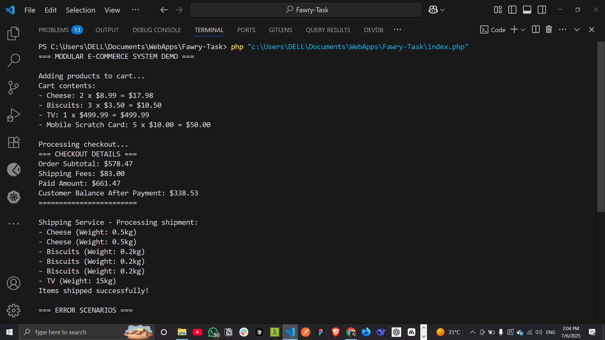
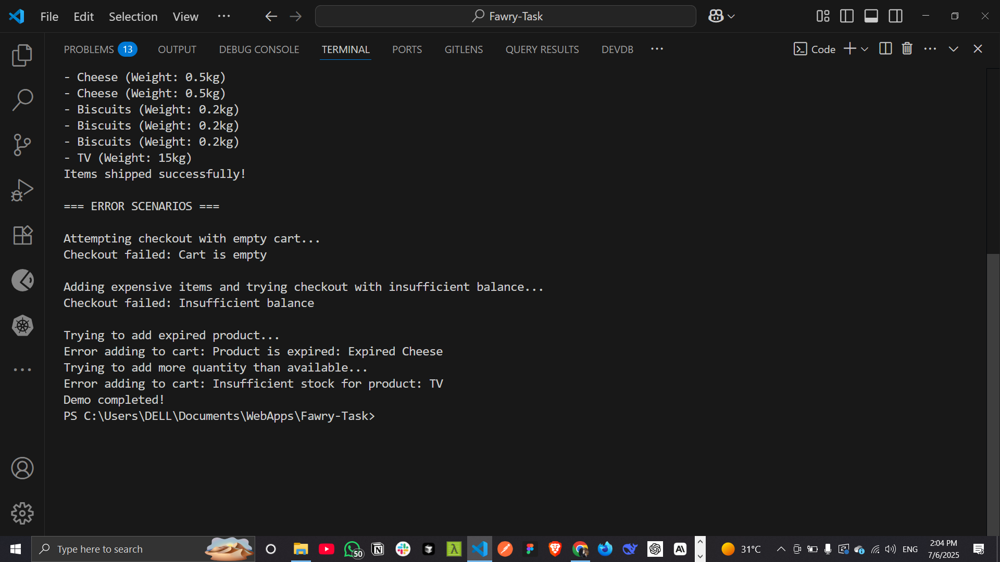

# E-Commerce System

This is a simple console app built in PHP for an E-Commerce Challenge.

## Features

- Add products with name, price, quantity
- Handle products that can expire or need shipping
- Add items to a cart with quantity checks
- Checkout with:
  - Subtotal
  - Shipping fees
  - Total amount
  - Updated customer balance
- Show shipped items and their weight

## Example Output

